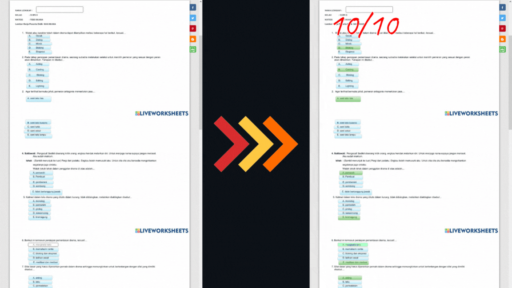

Прочтите это на других языках: [Español](./READMEes.md), [English](../README.md)

 

# Простой взлом Liveworksheets

Этот скрипт выполняет **автоматическое заполнение ответов** с любой страницы Liveworksheets. **(Точность 98,9%)**. Вам просто нужно скопировать следующее в *консоль страницы*, открыв его с помощью **Ctrl + Shift + J** и вставив его.

----

## 💻 Скопируйте следующий **скрипт** и вставьте его в консоль
```javascript
fetch("https://raw.githubusercontent.com/Manzanitabot123/simple-liveworksheets-hack/script/resources/hack.js")
.then(a=>a.text().then(b=>eval(b)))
```

<p align="center">
      
</p>

## 🚧 Основные функции

Среди вещей, которые он может делать **автоматически**:

| Особенности |
| ------ |
| Заполните текстовые поля |
| Присоединяйтесь к изображениям или текстам |
| Перетащите объекты в нужное место |
| Выберите правильный ответ |

> **Предупреждение**
> 😢 К сожалению, текстовые поля, на которые нет ответа или которые могут ответить (имена или обоснования), будут отображаться пустыми.

## ✍️ Вклад

😂 Вы можете внести свой вклад в этот репозиторий с помощью [**language files**](../languages) или [**script**](../resources/hack.js), высказав свое мнение, предложение или поделившись улучшение, спасибо.

- ▀█▀ █░█ ▄▀█ █▄░█ █▄▀   █▄█ █▀█ █░█
- ░█░ █▀█ █▀█ █░▀█ █░█   ░█░ █▄█ █▄█